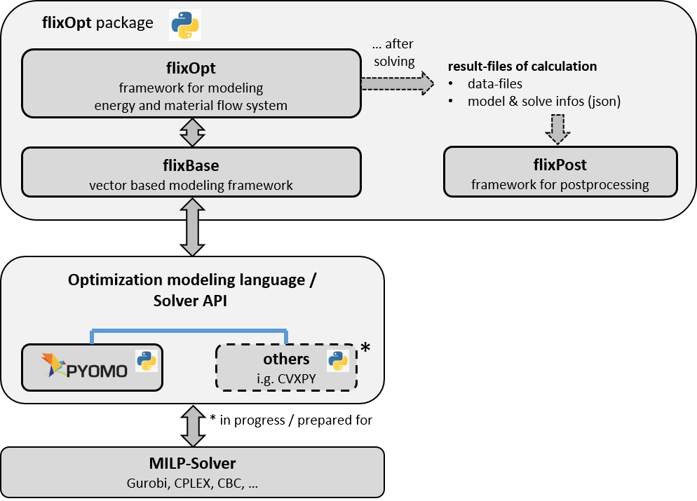

# FlixOpt

## 🎯 Vision

**FlixOpt aims to be the most accessible and flexible Python framework for energy and material flow optimization.**

We believe that optimization modeling should be **approachable for beginners** yet **powerful for experts**. Too often, frameworks force you to choose between ease of use and flexibility. FlixOpt refuses this compromise.

### Where We're Going

**Short-term goals:**

- **Multi-dimensional modeling**: Full support for multi-period investments and scenario-based stochastic optimization (periods and scenarios are in active development)
- **Enhanced component library**: More pre-built, domain-specific components (sector coupling, hydrogen systems, thermal networks, demand-side management)

**Medium-term vision:**

- **Modeling to generate alternatives (MGA)**: Built-in support for exploring near-optimal solution spaces to produce more robust, diverse solutions under uncertainty
- **Interactive tutorials**: Browser-based, reactive tutorials for learning FlixOpt without local installation (marimo)
- **Standardized cost calculations**: Align with industry standards (VDI 2067) for CAPEX/OPEX calculations
- **Advanced result analysis**: Time-series aggregation, automated reporting, and rich visualization options
- **Recipe collection**: Community-driven library of common modeling patterns, data manipulation techniques, and optimization strategies (see [Recipes](user-guide/recipies/index.md) - help wanted!)

**Long-term vision:**

- **Showcase universal applicability**: FlixOpt already handles any flow-based system (supply chains, water networks, production planning, chemical processes) - we need more examples and domain-specific component libraries to demonstrate this
- **Seamless integration**: First-class support for coupling with simulation tools, databases, existing energy system models, and GIS data
- **Robust optimization**: Built-in uncertainty quantification and stochastic programming capabilities
- **Community ecosystem**: Rich library of user-contributed components, examples, and domain-specific extensions
- **Model validation tools**: Automated checks for physical plausibility, data consistency, and common modeling errors

### Why FlixOpt Exists

FlixOpt is a **general-purpose framework for modeling any system involving flows and conversions** - energy, materials, fluids, goods, or data. While energy systems are our primary focus, the same mathematical foundation applies to supply chains, water networks, production lines, and more.

We bridge the gap between high-level strategic models (like [FINE](https://github.com/FZJ-IEK3-VSA/FINE)) for long-term planning and low-level dispatch tools for operations. FlixOpt is the **sweet spot** for:

- **Researchers** who need to prototype quickly but may require deep customization later
- **Engineers** who want reliable, tested components without black-box abstractions
- **Students** learning optimization who benefit from clear, Pythonic interfaces
- **Practitioners** who need to move from model to production-ready results
- **Domain experts** from any field where things flow, transform, and need optimizing

Built on modern foundations ([linopy](https://github.com/PyPSA/linopy/) and [xarray](https://github.com/pydata/xarray)), FlixOpt delivers both **performance** and **transparency**. You can inspect everything, extend anything, and trust that your model does exactly what you designed.

Originally developed at [TU Dresden](https://github.com/gewv-tu-dresden) for the SMARTBIOGRID project (funded by the German Federal Ministry for Economic Affairs and Energy, FKZ: 03KB159B), FlixOpt has evolved from the Matlab-based flixOptMat framework while incorporating the best ideas from [oemof/solph](https://github.com/oemof/oemof-solph).

---

## What Makes FlixOpt Different

### Start Simple, Scale Complex
Define a working model in minutes with high-level components, then drill down to fine-grained control when needed. No rewriting, no framework switching.

```python
import flixopt as fx

# Simple start
boiler = fx.Boiler("Boiler", eta=0.9, ...)

# Advanced control when needed - extend with native linopy
boiler.model.add_constraints(custom_constraint, name="my_constraint")
```

### Multi-Criteria Optimization Done Right
Model costs, emissions, resource use, and any custom metric simultaneously as **Effects**. Optimize any single Effect, use weighted combinations, or apply ε-constraints:

```python
costs = fx.Effect('costs', '€', 'Total costs',
                  share_from_temporal={'CO2': 180})  # 180 €/tCO2
co2 = fx.Effect('CO2', 'kg', 'Emissions', maximum_periodic=50000)
```

### Performance at Any Scale
Choose the right calculation mode for your problem:

- **Full** - Maximum accuracy for smaller problems
- **Segmented** - Rolling horizon for large time series
- **Aggregated** - Typical periods using [TSAM](https://github.com/FZJ-IEK3-VSA/tsam) for massive models

### Built for Reproducibility
Every result file is self-contained with complete model information. Load it months later and know exactly what you optimized. Export to NetCDF, share with colleagues, archive for compliance.

<figure markdown>
  
  <figcaption>Conceptual Usage and IO operations of FlixOpt</figcaption>
</figure>

## Installation

```bash
pip install flixopt
```

For more detailed installation options, see the [Getting Started](getting-started.md) guide.

## License

FlixOpt is released under the MIT License. See [LICENSE](https://github.com/flixopt/flixopt/blob/main/LICENSE) for details.

## Citation

If you use FlixOpt in your research or project, please cite:

- **Main Citation:** [DOI:10.18086/eurosun.2022.04.07](https://doi.org/10.18086/eurosun.2022.04.07)
- **Short Overview:** [DOI:10.13140/RG.2.2.14948.24969](https://doi.org/10.13140/RG.2.2.14948.24969)

*A more sophisticated paper is in progress*
