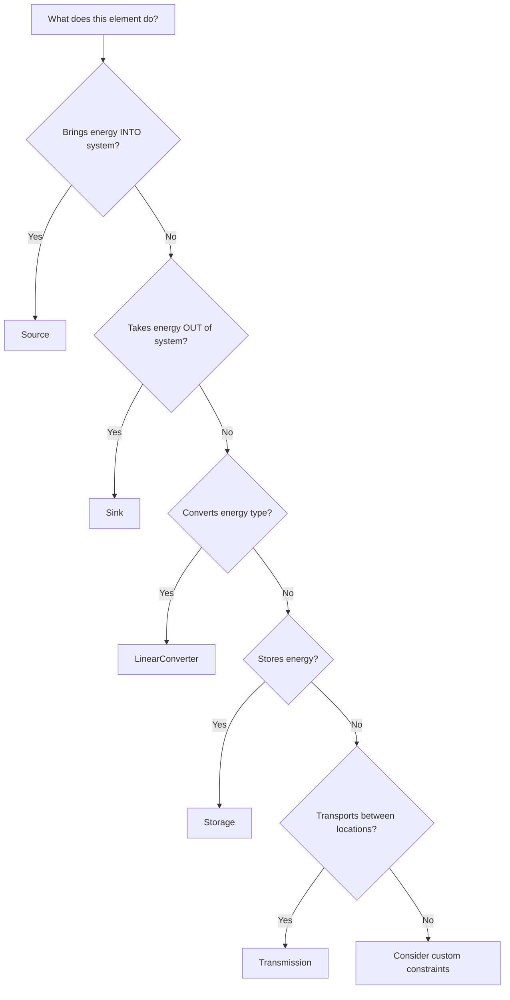

# Choosing Components

This guide helps you select the right flixOpt component for your modeling needs.

## Decision Tree



## Component Comparison

| Component | Purpose | Inputs | Outputs | Key Parameters |
|-----------|---------|--------|---------|----------------|
| **Source** | External supply | None | 1+ flows | `effects_per_flow_hour` |
| **Sink** | Demand/export | 1+ flows | None | `fixed_relative_profile` |
| **SourceAndSink** | Bidirectional exchange | 1+ flows | 1+ flows | Both input and output |
| **LinearConverter** | Transform energy | 1+ flows | 1+ flows | `conversion_factors` |
| **Storage** | Time-shift energy | charge flow | discharge flow | `capacity_in_flow_hours` |
| **Transmission** | Transport energy | in1, in2 | out1, out2 | `relative_losses` |

## Detailed Component Guide

### Source

**Use when:** Purchasing or importing energy/material from outside your system boundary.

```python
fx.Source(
    'GridElectricity',
    outputs=[fx.Flow(bus='Electricity', flow_id='Elec', size=1000, effects_per_flow_hour=0.25)]
)
```

**Typical applications:**
- Grid electricity connection
- Natural gas supply
- Raw material supply
- Fuel delivery

**Key parameters:**

| Parameter | Purpose |
|-----------|---------|
| `outputs` | List of flows leaving this source |
| `effects_per_flow_hour` | Cost/emissions per unit |
| `invest_parameters` | For optimizing connection capacity |

---

### Sink

**Use when:** Energy/material leaves your system (demand, export, waste).

```python
# Fixed demand (must be met)
fx.Sink(
    'Building',
    inputs=[fx.Flow(bus='Heat', size=1, fixed_relative_profile=demand)]
)

# Optional export (can sell if profitable)
fx.Sink(
    'Export',
    inputs=[fx.Flow(bus='Electricity', flow_id='Elec', size=100, effects_per_flow_hour=-0.15)]
)
```

**Typical applications:**
- Heat/electricity demand
- Product output
- Grid export
- Waste disposal

**Key parameters:**

| Parameter | Purpose |
|-----------|---------|
| `inputs` | List of flows entering this sink |
| `fixed_relative_profile` | Demand profile (on flow) |
| `effects_per_flow_hour` | Negative = revenue |

---

### SourceAndSink

**Use when:** Bidirectional exchange at a single point (buy AND sell from same connection).

```python
fx.SourceAndSink(
    'GridConnection',
    inputs=[fx.Flow(bus='Electricity', flow_id='import', size=500, effects_per_flow_hour=0.25)],
    outputs=[fx.Flow(bus='Electricity', flow_id='export', size=500, effects_per_flow_hour=-0.15)],
    prevent_simultaneous_flow_rates=True,  # Can't buy and sell at same time
)
```

**Typical applications:**
- Electricity grid (buy/sell)
- Gas grid with injection capability
- Material exchange with warehouse

---

### LinearConverter

**Use when:** Transforming one energy type to another with a linear relationship.

```python
# Single input, single output
fx.LinearConverter(
    'Boiler',
    inputs=[fx.Flow(bus='Gas', size=500)],
    outputs=[fx.Flow(bus='Heat', size=450)],
    conversion_factors=[{'Gas': 1, 'Heat': 0.9}],
)

# Multiple outputs (CHP)
fx.LinearConverter(
    'CHP',
    inputs=[fx.Flow(bus='Gas', size=300)],
    outputs=[
        fx.Flow(bus='Electricity', flow_id='Elec', size=100),
        fx.Flow(bus='Heat', size=150),
    ],
    conversion_factors=[{'Gas': 1, 'Elec': 0.35, 'Heat': 0.50}],
)

# Multiple inputs
fx.LinearConverter(
    'CoFiringBoiler',
    inputs=[
        fx.Flow(bus='Gas', size=200),
        fx.Flow(bus='Biomass', size=100),
    ],
    outputs=[fx.Flow(bus='Heat', size=270)],
    conversion_factors=[{'Gas': 1, 'Biomass': 1, 'Heat': 0.9}],
)
```

**Typical applications:**
- Boilers (fuel → heat)
- Heat pumps (electricity → heat)
- Chillers (electricity → cooling)
- Turbines (fuel → electricity)
- CHPs (fuel → electricity + heat)
- Electrolyzers (electricity → hydrogen)

**Key parameters:**

| Parameter | Purpose |
|-----------|---------|
| `conversion_factors` | Efficiency relationship |
| `piecewise_conversion` | Non-linear efficiency curve |
| `status_parameters` | On/off behavior, startup costs |

#### Pre-built Converters

flixOpt includes ready-to-use converters in `flixopt.linear_converters`:

| Class | Description | Key Parameters |
|-------|-------------|----------------|
| `Boiler` | Fuel → Heat | `thermal_efficiency` |
| `HeatPump` | Electricity → Heat | `cop` |
| `HeatPumpWithSource` | Elec + Ambient → Heat | `cop`, source flow |
| `CHP` | Fuel → Elec + Heat | `electrical_efficiency`, `thermal_efficiency` |
| `Chiller` | Electricity → Cooling | `cop` |

```python
from flixopt.linear_converters import Boiler, HeatPump

boiler = Boiler(
    'GasBoiler',
    thermal_efficiency=0.92,
    fuel_flow=fx.Flow(bus='Gas', flow_id='gas', size=500, effects_per_flow_hour=0.05),
    thermal_flow=fx.Flow(bus='Heat', flow_id='heat', size=460),
)
```

---

### Storage

**Use when:** Storing energy for later use.

```python
fx.Storage(
    'Battery',
    charging=fx.Flow(bus='Electricity', flow_id='charge', size=100),
    discharging=fx.Flow(bus='Electricity', flow_id='discharge', size=100),
    capacity_in_flow_hours=4,  # 4 hours at full rate = 400 kWh
    eta_charge=0.95,
    eta_discharge=0.95,
    relative_loss_per_hour=0.001,
    initial_charge_state=0.5,
)
```

**Typical applications:**
- Batteries (electrical)
- Thermal tanks (heat/cold)
- Hydrogen storage
- Material buffers

**Key parameters:**

| Parameter | Purpose |
|-----------|---------|
| `charging`, `discharging` | Flows for in/out |
| `capacity_in_flow_hours` | Size (or use `InvestParameters`) |
| `eta_charge`, `eta_discharge` | Round-trip efficiency |
| `relative_loss_per_hour` | Standing losses |
| `initial_charge_state` | Starting level (0-1 or `'equals_final'`) |

---

### Transmission

**Use when:** Transporting energy between different locations.

```python
# Unidirectional
fx.Transmission(
    'HeatPipe',
    in1=fx.Flow(bus='Heat_A', flow_id='from_A', size=200),
    out1=fx.Flow(bus='Heat_B', flow_id='to_B', size=200),
    relative_losses=0.05,
)

# Bidirectional
fx.Transmission(
    'PowerLine',
    in1=fx.Flow(bus='Elec_A', flow_id='A_to_B', size=100),
    out1=fx.Flow(bus='Elec_B', flow_id='at_B', size=100),
    in2=fx.Flow(bus='Elec_B', flow_id='B_to_A', size=100),
    out2=fx.Flow(bus='Elec_A', flow_id='at_A', size=100),
    relative_losses=0.03,
    prevent_simultaneous_flows_in_both_directions=True,
)
```

**Typical applications:**
- District heating pipes
- Power transmission lines
- Gas pipelines
- Conveyor belts

**Key parameters:**

| Parameter | Purpose |
|-----------|---------|
| `in1`, `out1` | Primary direction flows |
| `in2`, `out2` | Reverse direction (optional) |
| `relative_losses` | Proportional losses |
| `absolute_losses` | Fixed losses when active |
| `balanced` | Same capacity both ways |

## Feature Combinations

### Investment Optimization

Add `InvestParameters` to flows to let the optimizer choose sizes:

```python
fx.Flow(
    bus='Heat',
    invest_parameters=fx.InvestParameters(
        effects_of_investment_per_size={'costs': 100},  # €/kW
        minimum_size=0,
        maximum_size=1000,
    )
)
```

Works with: Source, Sink, LinearConverter, Storage, Transmission

### Operational Constraints

Add `StatusParameters` to flows for on/off behavior:

```python
fx.Flow(
    bus='Heat',
    size=500,
    status_parameters=fx.StatusParameters(
        effects_per_switch_on={'costs': 50},  # Startup cost
        on_hours_min=2,  # Minimum runtime
        off_hours_min=1,  # Minimum downtime
    )
)
```

Works with: All components with flows

### Non-Linear Efficiency

Use `PiecewiseConversion` for load-dependent efficiency:

```python
fx.LinearConverter(
    'GasEngine',
    inputs=[fx.Flow(bus='Gas', flow_id='Fuel')],
    outputs=[fx.Flow(bus='Electricity', flow_id='Elec')],
    piecewise_conversion=fx.PiecewiseConversion({
        'Fuel': fx.Piecewise([fx.Piece(100, 200), fx.Piece(200, 300)]),
        'Elec': fx.Piecewise([fx.Piece(35, 80), fx.Piece(80, 110)]),
    }),
)
```

Works with: LinearConverter

## Common Modeling Patterns

### Pattern: Parallel Redundant Units

Model N identical units that can operate independently:

```python
for i in range(3):
    flow_system.add_elements(
        fx.LinearConverter(
            f'Boiler_{i}',
            inputs=[fx.Flow(bus='Gas', size=100)],
            outputs=[fx.Flow(bus='Heat', size=90)],
            conversion_factors=[{'Gas': 1, 'Heat': 0.9}],
        )
    )
```

### Pattern: Heat Recovery

Model waste heat recovery from one process to another:

```python
# Process that generates waste heat
process = fx.LinearConverter(
    'Process',
    inputs=[fx.Flow(bus='Electricity', flow_id='Elec', size=100)],
    outputs=[
        fx.Flow(bus='Products', flow_id='Product', size=80),
        fx.Flow(bus='Heat', flow_id='WasteHeat', size=20),  # Recovered heat
    ],
    conversion_factors=[{'Elec': 1, 'Product': 0.8, 'WasteHeat': 0.2}],
)
```

### Pattern: Fuel Switching

Model a component that can use multiple fuels:

```python
flex_boiler = fx.LinearConverter(
    'FlexBoiler',
    inputs=[
        fx.Flow(bus='Gas', size=200, effects_per_flow_hour=0.05),
        fx.Flow(bus='Oil', size=200, effects_per_flow_hour=0.08),
    ],
    outputs=[fx.Flow(bus='Heat', size=180)],
    conversion_factors=[{'Gas': 1, 'Oil': 1, 'Heat': 0.9}],
)
```

## Next Steps

- **[Building Models](index.md)** — Step-by-step modeling guide
- **[Examples](../../notebooks/index.md)** — Working code examples
- **[Mathematical Notation](../mathematical-notation/index.md)** — Constraint formulations
