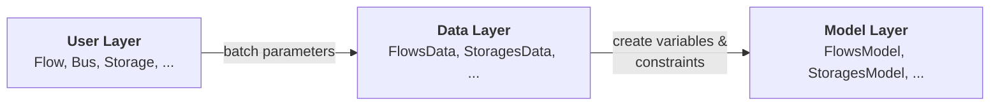

# Building Models

This guide walks you through constructing FlowSystem models step by step. By the end, you'll understand how to translate real-world energy systems into flixOpt models.

## Overview

Building a model follows a consistent pattern:

```python
import pandas as pd
import flixopt as fx

# 1. Define time horizon
timesteps = pd.date_range('2024-01-01', periods=24, freq='h')

# 2. Create the FlowSystem
flow_system = fx.FlowSystem(timesteps)

# 3. Add elements
flow_system.add_elements(
    # Buses, Components, Effects...
)

# 4. Optimize
flow_system.optimize(fx.solvers.HighsSolver())
```

## Step 1: Define Your Time Horizon

Every FlowSystem needs a time definition. Use pandas DatetimeIndex:

```python
# Hourly data for one week
timesteps = pd.date_range('2024-01-01', periods=168, freq='h')

# 15-minute intervals for one day
timesteps = pd.date_range('2024-01-01', periods=96, freq='15min')

# Custom timestamps (e.g., from your data)
timesteps = pd.DatetimeIndex(your_data.index)
```

!!! tip "Time Resolution"
    Higher resolution (more timesteps) gives more accurate results but increases computation time. Start with hourly data and refine if needed.

## Step 2: Create Buses

Buses are connection points where energy flows meet. Every bus enforces a balance: inputs = outputs.

```python
# Basic buses
heat_bus = fx.Bus('Heat')
electricity_bus = fx.Bus('Electricity')

# With carrier (enables automatic coloring in plots)
heat_bus = fx.Bus('Heat', carrier='heat')
gas_bus = fx.Bus('Gas', carrier='gas')
```

### When to Create a Bus

| Scenario | Bus Needed? |
|----------|-------------|
| Multiple components share a resource | Yes |
| Need to track balance at a location | Yes |
| Component has external input (grid, fuel) | Often no - use `bus=None` |
| Component transforms A → B | Yes, one bus per carrier |

### Bus Balance Modes

By default, buses require exact balance. For systems with unavoidable imbalances:

```python
# Allow small imbalances with penalty
heat_bus = fx.Bus(
    'Heat',
    imbalance_penalty_per_flow_hour=1000,  # High cost discourages imbalance
)
```

## Step 3: Add Components

Components are the equipment in your system. Choose based on function:

### Ports — External Inputs and Demands

Use for **importing** energy or materials from outside, or for **consuming** energy (demands, exports):

```python
# Grid electricity with time-varying price (importing into the system)
grid = fx.Port(
    'Grid',
    imports=[fx.Flow(bus='Electricity', size=1000, effects_per_flow_hour=price_profile)]
)

# Natural gas with fixed price (importing into the system)
gas_supply = fx.Port(
    'GasSupply',
    imports=[fx.Flow(bus='Gas', size=500, effects_per_flow_hour=0.05)]
)

# Heat demand (must be met exactly, exporting from the system)
building = fx.Port(
    'Building',
    exports=[fx.Flow(bus='Heat', size=1, fixed_relative_profile=demand_profile)]
)

# Optional export (can sell but not required)
export = fx.Port(
    'Export',
    exports=[fx.Flow(bus='Electricity', size=100, effects_per_flow_hour=-0.15)]  # Negative = revenue
)
```

### Converter — Transformations

Use for **converting** one form of energy to another:

```python
# Gas boiler: Gas → Heat
boiler = fx.Converter(
    'Boiler',
    inputs=[fx.Flow(bus='Gas', size=500)],
    outputs=[fx.Flow(bus='Heat', size=450)],
    conversion_factors=[{'Gas': 1, 'Heat': 0.9}],  # 90% efficiency
)

# Heat pump: Electricity → Heat
heat_pump = fx.Converter(
    'HeatPump',
    inputs=[fx.Flow(bus='Electricity', size=100)],
    outputs=[fx.Flow(bus='Heat', size=350)],
    conversion_factors=[{'Electricity': 1, 'Heat': 3.5}],  # COP = 3.5
)

# CHP: Gas → Electricity + Heat (multiple outputs)
chp = fx.Converter(
    'CHP',
    inputs=[fx.Flow(bus='Gas', size=300)],
    outputs=[
        fx.Flow(bus='Electricity', size=100),
        fx.Flow(bus='Heat', size=150),
    ],
    conversion_factors=[{'Gas': 1, 'Electricity': 0.35, 'Heat': 0.50}],
)
```

### Storage — Time-Shifting

Use for **storing** energy or materials:

```python
# Thermal storage
tank = fx.Storage(
    'ThermalTank',
    charging=fx.Flow(bus='Heat', size=200),
    discharging=fx.Flow(bus='Heat', size=200),
    capacity_in_flow_hours=10,  # 10 hours at full charge/discharge rate
    eta_charge=0.95,
    eta_discharge=0.95,
    relative_loss_per_hour=0.01,  # 1% loss per hour
    initial_charge_state=0.5,  # Start 50% full
)
```

### Transmission — Transport Between Locations

Use for **connecting** different locations:

```python
# District heating pipe
pipe = fx.Transmission(
    'HeatPipe',
    in1=fx.Flow(bus='Heat_A', size=200),
    out1=fx.Flow(bus='Heat_B', size=200),
    relative_losses=0.05,  # 5% loss
)
```

## Step 4: Configure Effects

Effects track metrics like costs, emissions, or energy use. One must be the objective:

```python
# Operating costs (minimize this)
costs = fx.Effect(
    'costs',
    '€',
    'Operating Costs',
    is_standard=True,  # Included by default in all effect allocations
    is_objective=True,  # This is what we minimize
)

# CO2 emissions (track or constrain)
co2 = fx.Effect(
    'CO2',
    'kg',
    'CO2 Emissions',
    maximum_temporal=1000,  # Constraint: max 1000 kg total
)
```

### Linking Effects to Flows

Effects are typically assigned per flow hour:

```python
# Gas costs 0.05 €/kWh
fx.Flow(bus='Gas', size=500, effects_per_flow_hour={'costs': 0.05, 'CO2': 0.2})

# Shorthand when only one effect (the standard one)
fx.Flow(bus='Gas', size=500, effects_per_flow_hour=0.05)
```

## Step 5: Add Everything to FlowSystem

Use `add_elements()` with all elements:

```python
flow_system = fx.FlowSystem(timesteps)

flow_system.add_elements(
    # Buses
    fx.Bus('Heat', carrier='heat'),
    fx.Bus('Gas', carrier='gas'),

    # Effects
    fx.Effect('costs', '€', is_standard=True, is_objective=True),

    # Components
    fx.Port('GasGrid', imports=[fx.Flow(bus='Gas', size=500, effects_per_flow_hour=0.05)]),
    fx.Converter(
        'Boiler',
        inputs=[fx.Flow(bus='Gas', size=500)],
        outputs=[fx.Flow(bus='Heat', size=450)],
        conversion_factors=[{'Gas': 1, 'Heat': 0.9}],
    ),
    fx.Port('Building', exports=[fx.Flow(bus='Heat', size=1, fixed_relative_profile=demand)]),
)
```

## Common Patterns

### Pattern 1: Simple Conversion System

Gas → Boiler → Heat

```python
flow_system.add_elements(
    fx.Bus('Heat'),
    fx.Effect('costs', '€', is_standard=True, is_objective=True),
    fx.Port('Gas', imports=[fx.Flow(bus='Gas', size=500, effects_per_flow_hour=0.05)]),
    fx.Converter(
        'Boiler',
        inputs=[fx.Flow(bus='Gas', size=500)],
        outputs=[fx.Flow(bus='Heat', size=450)],
        conversion_factors=[{'Gas': 1, 'Heat': 0.9}],
    ),
    fx.Port('Demand', exports=[fx.Flow(bus='Heat', size=1, fixed_relative_profile=demand)]),
)
```

### Pattern 2: Multiple Generation Options

Choose between boiler, heat pump, or both:

```python
flow_system.add_elements(
    fx.Bus('Heat'),
    fx.Effect('costs', '€', is_standard=True, is_objective=True),

    # Option 1: Gas boiler (cheap gas, moderate efficiency)
    fx.Converter('Boiler', ...),

    # Option 2: Heat pump (expensive electricity, high efficiency)
    fx.Converter('HeatPump', ...),

    # Demand
    fx.Port('Building', ...),
)
```

The optimizer chooses the cheapest mix at each timestep.

### Pattern 3: System with Storage

Add flexibility through storage:

```python
flow_system.add_elements(
    fx.Bus('Heat'),
    fx.Effect('costs', '€', is_standard=True, is_objective=True),

    # Generation
    fx.Converter('Boiler', ...),

    # Storage (can shift load in time)
    fx.Storage('Tank', ...),

    # Demand
    fx.Port('Building', ...),
)
```

## Component Selection Guide

| I need to... | Use this component |
|-------------|-------------------|
| Buy/import energy | `Port` with `imports` |
| Sell/export energy | `Port` with `exports` and negative effects |
| Meet a demand | `Port` with `exports` and `fixed_relative_profile` |
| Convert energy type | `Converter` |
| Store energy | `Storage` |
| Transport between sites | `Transmission` |
| Model combined heat & power | `Converter` with multiple outputs |

For detailed component selection, see [Choosing Components](choosing-components.md).

## Input Data Types

flixOpt accepts various data formats for parameters:

| Input Type | Example | Use Case |
|-----------|---------|----------|
| Scalar | `0.05` | Constant value |
| NumPy array | `np.array([...])` | Time-varying, matches timesteps |
| Pandas Series | `pd.Series([...], index=timesteps)` | Time-varying with labels |
| TimeSeriesData | `fx.TimeSeriesData(...)` | Advanced: aggregation metadata |

```python
# All equivalent for a constant efficiency
efficiency = 0.9
efficiency = np.full(len(timesteps), 0.9)
efficiency = pd.Series(0.9, index=timesteps)

# Time-varying price
price = np.where(hour_of_day >= 8, 0.25, 0.10)
```

## Debugging Tips

### Check Bus Balance

If optimization fails with infeasibility:

1. Ensure demands can be met by available generation
2. Check that flow sizes are large enough
3. Add `imbalance_penalty_per_flow_hour` to identify problematic buses

### Verify Element Registration

```python
# List all elements
print(flow_system.components.keys())
print(flow_system.buses.keys())
print(flow_system.effects.keys())
```

### Inspect Model Before Solving

```python
flow_system.build_model()
print(f"Variables: {len(flow_system.model.variables)}")
print(f"Constraints: {len(flow_system.model.constraints)}")
```

## Under the Hood

This section explains how flixOpt translates your Python objects into a mathematical optimization model. Understanding this is useful for accessing variables directly, debugging, or adding custom constraints.

### The Three-Layer Pipeline

When you call `flow_system.optimize()`, your model passes through three layers:



1. **User Layer** — The Python objects you create (`Flow`, `Bus`, `Converter`, etc.) with their parameters.
2. **Data Layer** — `*Data` classes (`FlowsData`, `StoragesData`, etc.) batch parameters from all elements of the same type into `xr.DataArray` arrays and validate them.
3. **Model Layer** — `*Model` classes (`FlowsModel`, `StoragesModel`, etc.) create linopy variables and constraints from the batched data.

For the full architecture reference, see the [Architecture Guide](../../architecture/batched_modeling.md).

### How Variables Are Organized

All variables follow a `type|variable` naming convention using a pipe delimiter:

| Variable Name | Description | Dimensions |
|--------------|-------------|------------|
| `flow\|rate` | Flow rates for all flows | `(flow, time, ...)` |
| `flow\|status` | On/off status (binary) | `(flow, time, ...)` |
| `flow\|size` | Invested capacity | `(flow, period, scenario)` |
| `storage\|charge` | Storage charge state | `(storage, time, ...)` |
| `storage\|netto` | Net discharge rate | `(storage, time, ...)` |
| `component\|status` | Component on/off status | `(component, time, ...)` |
| `effect\|total` | Total effect values | `(effect, period, scenario)` |

You can access these variables after building the model:

```python
flow_system.build_model()

# Access the underlying linopy model
model = flow_system.model

# List all variables
print(model.variables)

# Access a specific variable by name
rate = model.variables['flow|rate']
```

For the complete list of variable names, see the [Variable Names Reference](../../variable_names.md).

### Adding Custom Constraints

You can build the model without solving and add your own constraints using the [linopy](https://github.com/PyPSA/linopy) API:

```python
# Step 1: Build the model (without solving)
flow_system.build_model()

# Step 2: Access variables by their type|variable name
model = flow_system.model
flow_rate = model.variables['flow|rate']

# Step 3: Add a custom constraint
# Example: Force a specific flow to be at least 50 at every timestep
boiler_rate = flow_rate.sel(flow='Boiler(Heat)')
model.add_constraints(boiler_rate >= 50, name='custom_min_boiler')

# Step 4: Solve
flow_system.solve(fx.solvers.HighsSolver())
```

!!! tip "Finding the right variable name"
    Use `model.variables` to list all available variables after building. Variable names always start with the element type (`flow|`, `storage|`, `component|`, `effect|`, `bus|`).

## Next Steps

- **[Choosing Components](choosing-components.md)** — Decision tree for component selection
- **[Core Concepts](../core-concepts.md)** — Deeper understanding of fundamentals
- **[Examples](../../notebooks/index.md)** — Working code examples
- **[Mathematical Notation](../mathematical-notation/index.md)** — Detailed constraint formulations
