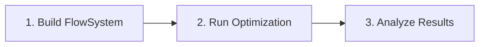
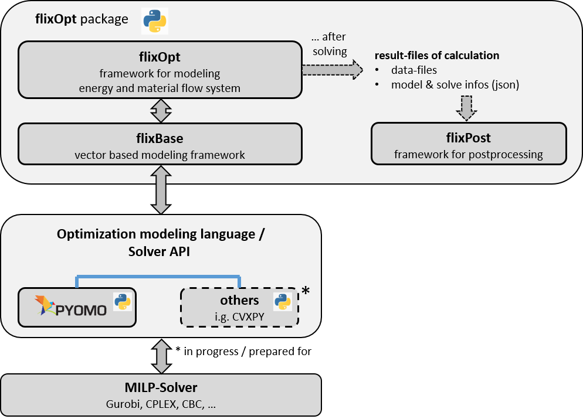

# Core Concepts

This page introduces the fundamental concepts of flixOpt through practical scenarios. Understanding these concepts will help you model any system involving flows and conversions.

## The Big Picture

Imagine you're managing a district heating system. You have:

- A **gas boiler** that burns natural gas to produce heat
- A **heat pump** that uses electricity to extract heat from the environment
- A **thermal storage tank** to buffer heat production and demand
- **Buildings** that need heat throughout the day
- Access to the **gas grid** and **electricity grid**

Your goal: **minimize total operating costs** while meeting all heat demands.

This is exactly the kind of problem flixOpt solves. Let's see how each concept maps to this scenario.

## Buses: Where Things Connect

A [`Bus`][flixopt.elements.Bus] is a connection point where energy or material flows meet. Think of it as a junction or hub.

!!! example "In our heating system"
    - **Heat Bus** — where heat from the boiler, heat pump, and storage meets the building demand
    - **Gas Bus** — connection to the gas grid
    - **Electricity Bus** — connection to the power grid

**The key rule:** At every bus, **inputs must equal outputs** at each timestep.

$$\sum inputs = \sum outputs$$

This balance constraint is what makes your model physically meaningful — energy can't appear or disappear.

### Carriers

Buses can be assigned a **carrier** — a type of energy or material (electricity, heat, gas, etc.). Carriers enable automatic coloring in plots and help organize your system semantically:

```python
heat_bus = fx.Bus('HeatNetwork', carrier='heat')  # Uses default heat color
elec_bus = fx.Bus('Grid', carrier='electricity')
```

See [Color Management](results-plotting.md#color-management) for details.

## Flows: What Moves Between Elements

A [`Flow`][flixopt.elements.Flow] represents the movement of energy or material. Every flow connects a component to a bus, with a defined direction.

!!! example "In our heating system"
    - Heat flowing **from** the boiler **to** the Heat Bus
    - Gas flowing **from** the Gas Bus **to** the boiler
    - Heat flowing **from** the Heat Bus **to** the buildings

Flows have:

- A **size** (capacity) — *"This boiler can deliver up to 500 kW"*
- A **flow rate** — *"Right now it's running at 300 kW"*

## Components: The Equipment

[`Components`][flixopt.elements.Component] are the physical (or logical) elements that transform, store, or transfer flows.

### Converters — Transform One Thing Into Another

A [`LinearConverter`][flixopt.components.LinearConverter] takes inputs and produces outputs with a defined efficiency.

!!! example "In our heating system"
    - **Gas Boiler**: Gas → Heat (η = 90%)
    - **Heat Pump**: Electricity → Heat (COP = 3.5)

The conversion relationship:

$$output = \eta \cdot input$$

### Storages — Save for Later

A [`Storage`][flixopt.components.Storage] accumulates and releases energy or material over time.

!!! example "In our heating system"
    - **Thermal Tank**: Store excess heat during cheap hours, use it during expensive hours

The storage tracks its state over time:

$$charge(t+1) = charge(t) + charging - discharging$$

### Sources & Sinks — System Boundaries

[`Sources`][flixopt.components.Source] and [`Sinks`][flixopt.components.Sink] connect your system to the outside world.

!!! example "In our heating system"
    - **Gas Source**: Buy gas from the grid at market prices
    - **Electricity Source**: Buy power at time-varying prices
    - **Heat Sink**: The building demand that must be met

## Effects: What You're Tracking

An [`Effect`][flixopt.effects.Effect] represents any metric you want to track or optimize. One effect is your **objective** (what you minimize or maximize), others can be **constraints**.

!!! example "In our heating system"
    - **Costs** (objective) — minimize total operating costs
    - **CO₂ Emissions** (constraint) — stay below 1000 tonnes/year
    - **Gas Consumption** (tracking) — report total gas used

Effects can be linked: *"Each kg of CO₂ costs €80 in emissions trading"* — this creates a connection from the CO₂ effect to the Costs effect.

## FlowSystem: Putting It All Together

The [`FlowSystem`][flixopt.flow_system.FlowSystem] is your complete model. It contains all buses, components, flows, and effects, plus the **time definition** for your optimization.

```python
import flixopt as fx

# Define timesteps (e.g., hourly for one week)
timesteps = pd.date_range('2024-01-01', periods=168, freq='h')

# Create the system
flow_system = fx.FlowSystem(timesteps)

# Add elements
flow_system.add_elements(heat_bus, gas_bus, electricity_bus)
flow_system.add_elements(boiler, heat_pump, storage)
flow_system.add_elements(costs_effect, co2_effect)
```

## The Workflow: Model → Optimize → Analyze

Working with flixOpt follows three steps:



### 1. Build Your Model

Define your system structure, parameters, and time series data.

### 2. Run the Optimization

Optimize your FlowSystem with a solver:

```python
flow_system.optimize(fx.solvers.HighsSolver())
```

### 3. Analyze Results

Access solution data directly from the FlowSystem:

```python
# Access component solutions
boiler = flow_system.components['Boiler']
print(boiler.solution)

# Get total costs
total_costs = flow_system.solution['costs|total']

# Use statistics for aggregated data
print(flow_system.statistics.flow_hours)

# Plot results
flow_system.statistics.plot.balance('HeatBus')
```

<figure markdown>
  
  <figcaption>Conceptual Usage and IO operations of FlixOpt</figcaption>
</figure>

## Quick Reference

| Concept | What It Represents | Real-World Example |
|---------|-------------------|-------------------|
| **Bus** | Connection point | Heat network, electrical grid |
| **Flow** | Energy/material movement | Heat delivery, gas consumption |
| **LinearConverter** | Transformation equipment | Boiler, heat pump, turbine |
| **Storage** | Time-shifting capability | Battery, thermal tank, warehouse |
| **Source/Sink** | System boundary | Grid connection, demand |
| **Effect** | Metric to track/optimize | Costs, emissions, energy use |
| **FlowSystem** | Complete model | Your entire system |

## FlowSystem API at a Glance

The `FlowSystem` is the central object in flixOpt. After building your model, all operations are accessed through the FlowSystem and its **accessors**:

```python
flow_system = fx.FlowSystem(timesteps)
flow_system.add_elements(...)

# Optimize
flow_system.optimize(solver)

# Access results
flow_system.solution                    # Raw xarray Dataset
flow_system.statistics.flow_hours       # Aggregated statistics
flow_system.statistics.plot.balance()   # Visualization

# Transform (returns new FlowSystem)
fs_subset = flow_system.transform.sel(time=slice(...))

# Inspect structure
flow_system.topology.plot()
```

### Accessor Overview

| Accessor | Purpose | Key Methods |
|----------|---------|-------------|
| **`solution`** | Raw optimization results | xarray Dataset with all variables |
| **`statistics`** | Aggregated data | `flow_rates`, `flow_hours`, `sizes`, `charge_states`, `total_effects` |
| **`statistics.plot`** | Visualization | `balance()`, `heatmap()`, `sankey()`, `effects()`, `storage()` |
| **`transform`** | Create modified copies | `sel()`, `isel()`, `resample()`, `cluster()` |
| **`topology`** | Network structure | `plot()`, `start_app()`, `infos()` |

### Element Access

Access elements directly from the FlowSystem:

```python
# Access by label
flow_system.components['Boiler']        # Get a component
flow_system.buses['Heat']               # Get a bus
flow_system.flows['Boiler(Q_th)']       # Get a flow
flow_system.effects['costs']            # Get an effect

# Element-specific solutions
flow_system.components['Boiler'].solution
flow_system.flows['Boiler(Q_th)'].solution
```

## Beyond Energy Systems

While our example used a heating system, flixOpt works for any flow-based optimization:

| Domain | Buses | Components | Effects |
|--------|-------|------------|---------|
| **District Heating** | Heat, Gas, Electricity | Boilers, CHPs, Heat Pumps | Costs, CO₂ |
| **Manufacturing** | Raw Materials, Products | Machines, Assembly Lines | Costs, Time, Labor |
| **Supply Chain** | Warehouses, Locations | Transport, Storage | Costs, Distance |
| **Water Networks** | Reservoirs, Treatment | Pumps, Pipes | Costs, Energy |

## Next Steps

- **[Building Models](building-models/index.md)** — Step-by-step guide to constructing models
- **[Examples](../notebooks/index.md)** — Working code for common scenarios
- **[Mathematical Notation](mathematical-notation/index.md)** — Detailed constraint formulations

## Advanced: Extending with linopy

flixOpt is built on [linopy](https://github.com/PyPSA/linopy). You can access and extend the underlying optimization model for custom constraints:

```python
# Build the model (without solving)
flow_system.build_model()

# Access the linopy model
model = flow_system.model

# Add custom constraints using linopy API
model.add_constraints(...)

# Then solve
flow_system.solve(fx.solvers.HighsSolver())
```

This allows advanced users to add domain-specific constraints while keeping flixOpt's convenience for standard modeling.
