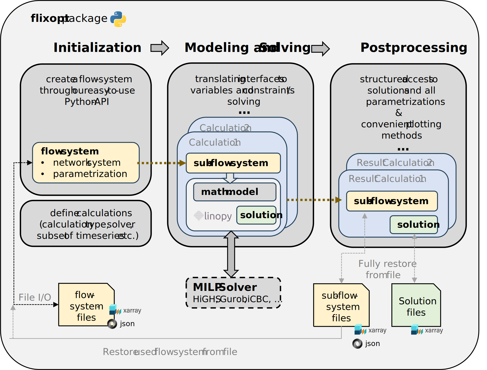

## Summary

Flixopt is an open-source Python framework for the mixed-integer linear optimization of systems with energy and material flows. It addresses the growing complexity of modern supply systems—characterized by fluctuating renewables, sector coupling, storage integration, and diverse technology portfolios—by providing a general, extensible, and vectorized modeling architecture. Built on the linear optimization package Linopy [@Hofmann2023], Flixopt allows users to flexibly represent system topologies, configure operational and investment decisions, and evaluate multiple metrics through its novel *Effects* concept. While developed primarily for energy-system studies such as heat supply systems, the framework is domain-agnostic and suitable for any flow-based system where modular modeling and transparency are essential.

## Statement of Need

Existing energy system modeling frameworks as reviewed in [@HOFFMANN2024100190] are often tailored to particular use cases, have limited flexibility for extensions, unflexible handling of timesteps or do not support different evaluation metrics beyond the monetary costs. This highlights the need for more flexible, framework-based modeling tools capable of adapting to diverse questions. 
In addition to the need for more flexible and adaptable settings, the efficient handling of equations in a vector-based form has emerged as an important requirement, as it supports improved mathematical modeling, enhances computational performance, and facilitates better transparency and manageability of the model’s equation set.
 [@PyPSA]

Flixopt fills this gap by enabling:

* full flexibility of system construction 
* detailed representation of operational and investment behavior
* arbitrary evaluation metrics through *Effects*, supporting multiobjective and constrained formulations. 
* todo: dimensions scenario and period!

ODER
* allocating impacts to freely definable evaluation metrics, through *Effects*, supporting multiobjective and constrained formulations.
* easy switch of objectives and wide flexibility of configuration of the calculation

Flixopt is designed for flexible use across various disciplines and research questions or practical tasks ranging from operational dispatch to strategic planning.

## Software Description

The architecture and workflow of the Flixopt package consist of three main steps: initialization, modeling and solving, and postprocessing of results; illustrated in \autoref{fig:architecture}. Users begin by implementing a flow‑system, defining the network topology and all element parameters. The flow-system describes the structural representation of a physical system to be modeled. It consists of *Flows*, *Components* and *Buses* inspired by [@oemof_2020]. Based on an arbitrary subset of the flow-system, one or more calculation setups can then be configured.  
During modeling, Flixopt constructs the optimization problem in a fully vectorized manner using Linopy. After solving, Flixopt provides a postprocessing environment that yields structured access to results, facilitates visualization and statistical analysis, and enables saving/restoring complete solution states.

Each user-defined element is associated with an internal model that generates constraints and variables in a vectorized form using Linopy. Optional features add investment decisions, on/off states, minimum up- or downtimes, mutual exclusivity of flows, piecewise-linear relations etc. These capabilities remain inactive unless explicitly required, keeping models compact and computationally efficient.

Flixopt supports several calculation modes. The default mode performs full time-resolved optimization. Aggregated modes use clustered typical periods, following principles discussed in the literature on time-series aggregation ([@TSAM2020]), reducing computational burden for long time horizons. A segmented mode decomposes large operational problems into smaller, sequentially optimized blocks.

## Effects

Flixopt introduces a freely definable system of evaluation metrics called *Effects* such as costs, emissions, primary energy demand, or any user-defined indicators. Any structural entity can contribute shares to any *Effect* and *Effects* can contribute to each other. This abstraction through *Effects* has the following advantages over a traditional rigid objective, as it generically integrates the following features:
* Switch the objective to another *Effect* easily, once *Effects* and a flow-system are defined.
* Include as many evaluation metrics as needed to simplify the evaluation of the solution. 
  * Example: Instead of a global objective ’costs’, you could divide it into ’energy costs’, ’labor costs’, ’funding’, ’revenues’ and more, which all have a share to the ’net total’. This way it is possible to access these metrics individually after the optimization.
* Constrain the solution space for the programming problem via additional criteria, that are not included in the objective (ϵ-constraint method [@HOFFMANN2024100190]). 
  * Example 1: Available floor space as a constraint on investment options.
  * Example 2: Limitation of ’primary energy demand’ or ’CO2 emission’ for a supply task.
  * Example 3: Limitation or necessity of a ’number of installed entities’ for the investment decision.
* Combine multiple evaluation metrics to the objective (Weighted Sum Method [@HOFFMANN2024100190]). 
  * Example 1: ’CO2 emissions’ contribute to the ’costs’ through CO2 taxes.
  * Example 2: ’floor space area’ used for investments contribute to the ’costs’ through the land price.
* Distinguish between operational and investment impacts and constraints of an evaluation criteria. 
  * Example: Only operational ’CO2 emissions’ should be integrated to cost objective via CO2 taxes, as investment related CO2 emission costs are already included in the component costs.
* Adjust the optimization by using an additional Effect to apply an incentive for or against an investment or dispatch decision without altering existing effects. This simplifies modeling to generate alternatives and comparing their results.

## Scenarios and Periods 

todo! Idealerweise kurz und kleines Bild dazu.

## References

siehe unten!

# ++ Textschnipsel näher am smart energy paper (und zu lang)! ++
## Introduction

Flixopt is a Python framework for mixed‑integer linear programming and optimization of complex systems with energy and material flows. It builds on a MATLAB® framework that has been migrated to Python and incorporates principles from earlier work as well as ideas from the Python package oemof/solph. Flixopt is published under the MIT license. Its generic and extensible approach allows application in a wide variety of scenarios. It enables non‑equidistant timesteps, allocation of impacts to freely definable evaluation metrics, switching between objectives, and broad flexibility in configuring the optimization. A short overview was previously published, but this paper provides a comprehensive description of the framework and introduces its novel concepts (e.g., *Effects*).

Although development has focused mainly on optimizing energy systems — especially district heating systems — Flixopt is designed to be usable across disciplines and research questions.

## Architecture and workflow of Flixopt

The architecture and workflow of the Flixopt package consist of three main steps: initialization, modeling and solving, and postprocessing of results. Users begin by implementing a flow‑system, defining the network topology and all element parameters. Based on the flow-system or an arbitrary subset of it, one or more calculation setups can then be configured, including the choice of solver.

During modeling, Flixopt constructs the optimization problem in a fully vectorized manner using Linopy. After solving, Flixopt provides a postprocessing environment that yields structured access to results, facilitates visualization and statistical analysis, and enables saving/restoring complete solution states.

The architecture and workflow of the Flixopt package consist of three main steps: initialization, modeling and solving, and postprocessing of results. Users begin by implementing a flow‑system consisting of *Element* objects, defining the network topology and all element parameters. One or more calculation setups can then be configured, including the choice of solver, calculation mode, and selected time horizon or segment.

During modeling, Flixopt creates for each calculation a sub‑flow‑system derived from the base model. It then constructs the optimization problem in a fully vectorized manner using Linopy, which handles array‑based modeling and solver communication. After solving, Flixopt provides a postprocessing environment that yields structured access to results, facilitates visualization and statistical analysis, and enables saving/restoring complete solution states.

## Structure and Mathematical Modeling

Flixopt models systems as flow‑systems consisting of *Flows*, *Components*, *Buses*, and *Effects*, all of which are subclasses of *Element*. While *Flows*, *Components*, and *Buses* represent structural aspects of energy or material systems — similar to many existing frameworks — the concept of *Effects* is a novel contribution. *Effects* capture evaluation metrics such as costs, CO₂ emissions, primary energy demand, floor area, number of units, or any other metric defined by the user.

Each *Element* is linked to an internal *Elementmodel* created during modeling. *Elementmodels* manage variables and constraints, while *Elements* store user parameters and serve as the user‑facing interface. Optional *Features* extend *Elementmodels* with additional functionality, such as investment decisions, on/off states, or linear segments.

Time handling in Flixopt is fully flexible: users may define equidistant or non‑equidistant timesteps, and the framework automatically derives timestep durations and total time spans.

## Effects and Objective

Effects are central to Flixopt’s abstraction of evaluation metrics. This enables: (1) multi‑criteria evaluation, (2) ε‑constraint formulations, (3) weighted‑sum multiobjective optimization, (4) distinguishing operational and investment impacts, and (5) external incentives without altering existing effect definitions. One effect is chosen as the objective, and a general penalty term is added to ensure solvability and improve debugging.

## Components, Flows, and Buses

## Features

Flixopt’s feature system extends elements with optional advanced modeling capabilities:

* Investment decisions with continuous sizes and binary selection.
* On/off states and switching behavior.
* Minimum/maximum consecutive operation or downtime.
* Prevention of simultaneous flow operation.
* Piecewise linear relations via linear segments.

## Calculation Modes

Flixopt supports several calculation modes: exact time‑resolved modeling, segmented optimization for long horizons, and aggregated/typical‑period approaches based on time‑series clustering. These modes reduce computational effort while preserving system characteristics.

# Acknowledgements

# todo
* Prüfen, dass möglichst alle Literaturquellen verwendet 

# References
* todo: Prüfen, dass möglichst alle Literaturquellen verwendet 
